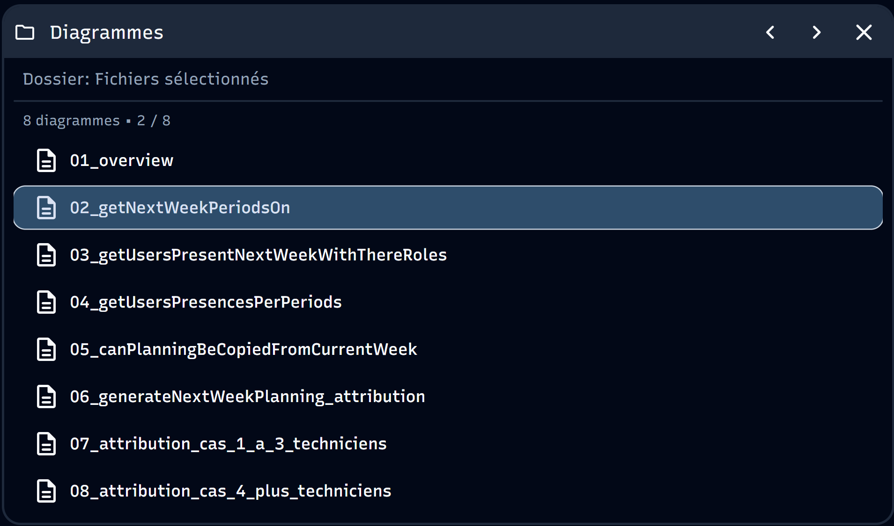

# Documentation détaillée de l'algorithme d'attribution des piquets

Ce dossier contient la décomposition de l'algorithme complexe d'attribution des piquets (garde téléphonique) en plusieurs fichiers Mermaid plus lisibles.

## Visualisation

Ces fichiers peuvent être visualisés avec :

```bash
git clone https://github.com/AdWav/mermaid-live-editor

cd mermaid-live-editor

docker compose up -d --build
```

- Aller sur localhost:3000 (ou autre port si déjà occupé)
- Cliquer sur "Actions" puis sur "Charger un dossier de diagrammes"
- Sélectionner les différents diagrammes et...



Ou (sans l'option "Charger un dossier de diagrammes") :

- [Mermaid Live Editor](https://mermaid.live/)
- Extensions VS Code/Cursor pour Mermaid (recommandé : "Markdown Preview Mermaid Support" ou "Mermaid Preview")
- Outils de documentation qui supportent Mermaid

## Structure des fichiers

### 01_overview.mmd

Vue d'ensemble de la fonction principale `generateNextWeekPlanning()` qui montre le flux général et les appels aux différentes fonctions.

### 02_getNextWeekPeriodsOn.mmd

Fonction simple qui récupère les périodes de la semaine prochaine en excluant les périodes "Off".

### 03_getUsersPresentNextWeekWithThereRoles.mmd

Récupère tous les utilisateurs présents la semaine prochaine avec leurs rôles et initialise leurs compteurs d'assignation.

### 04_getUsersPresencesPerPeriods.mmd

Calcule pour chaque période quels techniciens sont disponibles (premier, deuxième, troisième technicien) en fonction de leurs présences.

### 05_canPlanningBeCopiedFromCurrentWeek.mmd

Vérifie si le planning de la semaine courante peut être copié vers la semaine prochaine (fonction à compléter).

### 06_generateNextWeekPlanning_attribution.mmd

Logique principale d'attribution des techniciens aux périodes. Contient un SWITCH qui divise la logique selon le nombre de techniciens disponibles et appelle les sous-processus 07 ou 08.

### 07_attribution_cas_1_a_3_techniciens.mmd

**Sous-processus du fichier 06** - Détail de l'attribution lorsque 1 à 3 techniciens sont disponibles pour une période. Appelé depuis le CASE 1 to 3 du fichier 06.

### 08_attribution_cas_4_plus_techniciens.mmd

**Sous-processus du fichier 06** - Détail de l'attribution lorsque 4 ou plus techniciens sont disponibles pour une période. Appelé depuis le CASE 4 or more du fichier 06.

## Hiérarchie des fichiers

```text
01_overview.mmd (processus)
├── 02_getNextWeekPeriodsOn.mmd (sous-processus)
├── 03_getUsersPresentNextWeekWithThereRoles.mmd (sous-processus)
├── 04_getUsersPresencesPerPeriods.mmd (sous-processus)
├── 05_canPlanningBeCopiedFromCurrentWeek.mmd (sous-processus)
└── 06_generateNextWeekPlanning_attribution.mmd (sous-processus)
    ├── 07_assignCaseOneToThreeTechnicians.mmd (sous sous-processus)
    └── 08_assignCaseFourOrMoreTechnicians.mmd (sous sous-processus)
```

## Comment utiliser ces fichiers

1. Commencez par `01_overview.mmd` pour comprendre le flux général
2. Explorez chaque fonction individuellement selon vos besoins
3. Le fichier 06 contient la logique principale d'attribution avec un SWITCH
4. Les fichiers 07 et 08 sont des **sous-processus détaillés** du fichier 06, appelés selon le nombre de techniciens disponibles

## Navigation interactive (Ne marche pas pour le moment)

Tous les diagrammes contiennent des **liens cliquables** pour faciliter la navigation :

- Dans `01_overview.mmd` : cliquez sur les processus (p1, p2, p3, p4, p5) pour ouvrir les fichiers détaillés correspondants
- Dans `06_generateNextWeekPlanning_attribution.mmd` : cliquez sur les sous-processus (p1, p2) pour ouvrir les cas d'attribution détaillés
- Dans chaque fichier détaillé : cliquez sur le nœud "← Retour" en haut pour revenir au fichier parent

### Note importante sur les liens

Le fonctionnement des liens cliquables dépend de votre outil de visualisation :

- **VS Code / Cursor avec extension Mermaid** : Les liens peuvent nécessiter un clic droit ou Ctrl+clic selon l'extension
- **Mermaid Live Editor** : Les liens fonctionnent directement au clic
- **GitHub / GitLab** : Les liens dans les diagrammes Mermaid ne sont pas toujours supportés

Si les liens ne fonctionnent pas dans votre environnement, vous pouvez toujours naviguer manuellement entre les fichiers en utilisant la hiérarchie ci-dessus.
